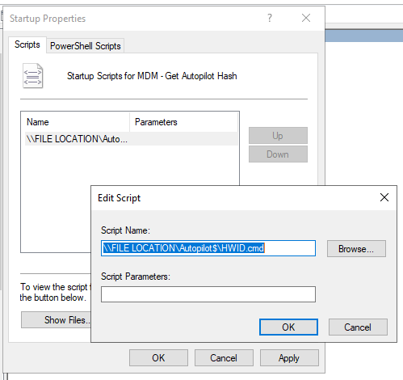

# GPO-AutopilotHashGenerator

Powershell Script that generates Windows Autopilot Hashes (HWID) to a CSV on a File Share location

# How to Use

1.  Download the Repository
2.  Create a (hidden) File-share, set ‘Everyone’ to Read (e.g. \\\\SERVERNAME\\Autopilot\$)
3.  Copy the files of the repo to the created file-share
4.  Open HWID.cmd in a text-editor (VS Code, Notepad++ etc.)
5.  Edit line 2: Change file-share location to the created File share – PS1 Script location (e.g. \\\\SERVERNAME\\Autopilot\$\\Get-WindowsAutoPilotInfo.ps1)
6.  Edit line 4: Change file-share location to the created File share – HWID Location (e.g. \\\\SERVERNAME\\Autopilot\$\\Hashes)
7.  Open the Group Policy Editor
8.  Create a new policy, scope to Domain Computers
9.  Go to ‘Windows Settings -\> Scripts (Startup/Shutdown)-\> Startup
10. Add the HWID.cmd script to Startup Scripts

    

11. Scope to Domain Computers
12. Done!
